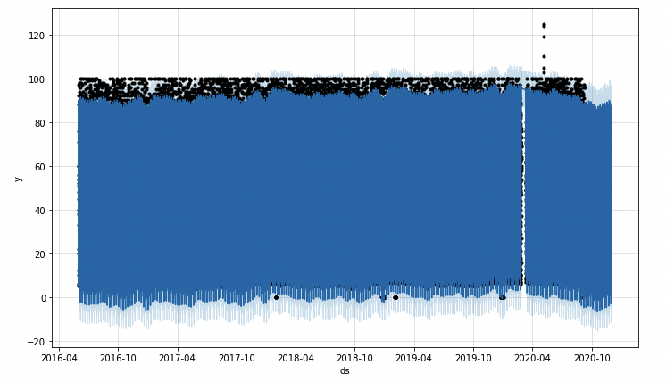

# mercado-growth-analysis
FinTech Challenge 11 -- MercadoLibre Growth and TimeSeries Analysis  

See full implementation and notebook details in [forecasting_net_prophet.ipynb](app/forecasting_net_prophet.ipynb)  

---

## Overview Of Analysis

MercadoLibre is a popular e-commerce site in Latin America. This is a multi-faceted analysis of the company's financial and user data, aimed at shedding insights which will help the company grow. 

At a high-level, the following will be performed:  
- visual depictions of seasonality based on Google Search trends
- evaluation of how stock price correlates to Google Search trends
- [Prophet](https://facebook.github.io/prophet/docs/quick_start.html#python-api) forecast model predicting hourly search traffic
- a plot of forecast for future company revenue  

See full implementation and notebook details in [forecasting_net_prophet.ipynb](app/forecasting_net_prophet.ipynb)  

---  

## DataSet Details  

Data sets used to anlyze this space:
- [google_hourly_search_trends.csv](data/google_hourly_search_trends.csv) hourly google trend data
    - contains data: `Date | Search Trends `  
- [mercado_daily_revenue.csv](data/mercado_daily_revenue.csv)
    - contains data: `date | Daily Sales `  
- [mercado_stock_price.csv](data/mercado_stock_price.csv)
    - contains data: `date | close `  

---  

## Result Detail  

### Search Traffic Patterns

Mercado Libre released its quarterly results in May 2020. This month was isolated and analysed.  
The traffic in May 2020 was `38181`, which is `8.55%` higher than the median monthly traffic of `35172.5`.  

**Mercado Search Trends - May 2020**  


### Seasonality Mining From Search Data

Daily, hourly, and weekly seasonality was observed in the search data.  
`Daily` - Tues had the highest average search traffic, with Monday a close second.  
`Hourly` - The heatmap reveals that nearly every day, search traffic is highest from hour 22 to hour 01. Sunday however has a longer lull of low traffic from eary to mid day, but is still high by hour 23 at the day's end.  
`Weekly` - The search traffic does show a rise during weeks 40 to 52, rising from 45.3 in week 42 to 49.7 in week 51. Traffic drops at the very last/first week of the year.  

  
  
  


### Search Traffic to Stock Price Correlation

The MercadoLibre stock price data from Jan 2015 -> July 2020 was analyzed in a few ways. First the price data was plotted for the entire time frame. Then the first half of 2020 price data was focused on, to see if any patterns emerged from the shock of March 2020. Lastly, lagged search trends, volatility, and hourly returns were examined for correlation.  

  

**2020 First Half Focus (Jan - June)**  

Looking at the MercadoLibre stock price in detail from Jan-Jun 2020, indeed you can see a big drop of the price in March 2020, then a steady increase in price from March thru June happened. Eventually, the stock price surpassed the price pre-March shock, ending at `973`, when the pre-March high was only `753`.  
However, while the search trends also had a big drop/gap in March 2020, the pattern returned pretty quickly after the initial shock, and actually was lower overall from the pre-March values. For example, the pre-March range was from `8-60` regularly, but after March, the value ranged from about `7-55`.  

  

Volatility, Lagged Search Trends and Hourly Stock Returns were calculated and analyzed for correlation:  

  
**Correlation**  
  


Observations from correlation table:  
`Lagged Search Trends vs Stock Volatility`  
There is a small negative correlation of `-0.148938` between Lagged Search Trends and Stock Volatility. This means that the two values *weakly* move opposite of each other.  

`Lagged Search Trends vs Stock Returns`  
There is an even smaller positive correlation of `0.017929` between Search Trends and Stock Returns. This value is so low that its probably worth considering these two values uncorrelated.  


### Prophet Time Series Model

Mercado hourly search trend data was analyzed with the Prophet library. A roughly 80 day near-term forecast was generated from the fit model. Below is a graph showing the plot of the historical data model and the 80 day forecast at the tail. The near-term forecast trends downward for the first half of the forecast, then gradually trends upward. By the end of the forecast, the trend has almost recovered to the value of the search trend pre-forecast.  

**Fit Model w/Forecast Tail**  
  

**Forecast Close Up**  
  

The prophet model also revealed weekly, yearly, and daily patterns in the time series data for the search trends:  

  

**Observations:**  
The `daily` plot shows that Mercado search is most popular in the late evening, until about midnight. So, approximately from 20:00 - 01:00 every day.  

The `weekly` plot shows that Mercado has the highest search traffic on Tuesday overall, although it significantly ramps up as Monday progresses, with the highest weekly peak late-Mon into early Tues.  

The `yearly` plot shows that Mercado search traffic bottoms out about mid-October each year.  


### Forecast Revenue From Prophet Time Series Model

Mercado daily historical sales data was analyzed with the Prophet library. Seasonal patterns were identified, and a sales forecast was prepared for the finance group.  

**Mercado Daily Sales Revenue**  
  

**Mercado Seasonal Revenue Patterns**  
  

**Observation:** Tues appears to be peak revenue day, with Monday a close second. It drops from Wednesday through the weekend.  

A sales forecast was prepared for the finance group, highlighting the best case, worst case and most likely scenario for the upcoming quarter (~90 days).  

**Fit Sales/Revenue Model With Forecast**  
  
**Sales Forecast (best/worst/likely)**  
  

**Mercado Upcoming Quarterly Forecast**  
The upcoming quarter (90-days following the most recent sales data which ended 5/14) predictions are:
```
Upcoming 90-Day Expected Total Sales (sum of sales):

Worst Case     1772.191610
Best Case      2116.791188
Most Likely    1945.369578

```


See full implementation and notebook details in [forecasting_net_prophet.ipynb](app/forecasting_net_prophet.ipynb)  


---

## Technologies

This challenge uses [python](https://www.python.org/) 3.7 and the following [built-in](https://docs.python.org/3/py-modindex.html) modules:
- [os](https://docs.python.org/3/library/os.html#module-os)
- [pathlib](https://docs.python.org/3/library/pathlib.html)
- [datetime](https://docs.python.org/3/library/datetime.html)

Additionally, it requires:
- [matplotlib](https://matplotlib.org/)
- [pandas](https://pandas.pydata.org/)
- [JupyterLab](https://jupyterlab.readthedocs.io/en/stable/)
- [scikit-learn](https://scikit-learn.org/stable/index.html)
- [fbprophet](https://scikit-learn.org/stable/index.html)
- [hvplot](https://hvplot.holoviz.org/)  

See [installation](#installation) below for specifics.

---

## Installation

You will need Python 3.7, that supports for this application to run. An easy way to install python 3.7 is to download and install [Anaconda](https://www.anaconda.com/products/individual). After installing anaconda, open a terminal/command-prompt, and setup a python 3.7 environment, and then activate it like so:

```
# create an anaconda python 3.7 environment
# name can be any friendly name to refer to your environment, eg 'dev'
conda create --name dev python=3.7 anaconda

# activating the environment
conda activate dev

# use pip to install the above modules, eg:
pip install python-dotenv
...etc...
```


---

## Usage

The analysis is presented within a [JupyterLab](https://jupyterlab.readthedocs.io/en/stable/) notebook. To launch JupyterLab, from the root of this repo dirctory:

```
# within repo root 
$ jupyter lab
```
You can now open and run the notebook [credit_risk_resampling.ipynb](app/credit_risk_resampling.ipynb)  

---

## Contributors

[David Lopez](https://github.com/sububer)

---

## License

MIT